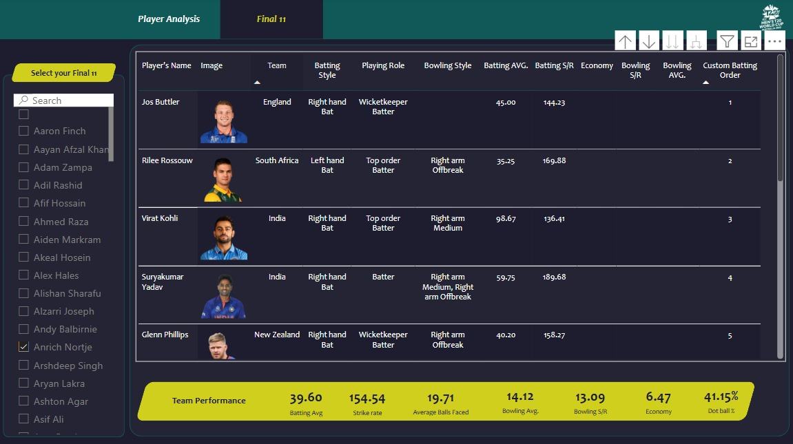

# Cricket Data Analytics using Power BI
### This project is done to analyse the performance of each player across the world and to get insights and then build a Best Playing 11 (My Drteam Team)
#### The datasets for this project is been taken from the github repository https://github.com/codebasics/DataAnalysisProjects/tree/master/5_CricketT20Analytics/data_collection/t20_csv_files

